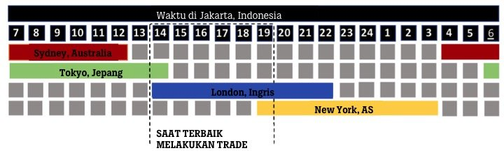

# 1. Dasar Membaca Candle

cheat sheet singkat untuk membaca candle market

Edit: ada banyak sekali nama-nama candle, cuman yg harus di ketahui adalah 2 ini saja. sisanya tidak perlu di ingat.

## Body dan Wick

- 

## Engulfing Candle Merah

- 

## Engulfing Candle Hijau

-

## Doji

- 

# 2.1 Dasar Membaca Trend & Menentukan Arah

Ada banyak cara membaca pergerakan candle, seperti menggunakan alligator, moving averages, kumo ccloud, Volume profile analyisis. cuman jangan di pelajarin semuanya, rata-rata hampir sama. paket komplitnya ada di market structure

- 
- 
- 
- 
- 

## materi tambahan: hanya di perlukan untuk memahami materi 6.3 (Liquidity)

- 
- 

# 2.2 Dasar Membaca Trend & Menentukan Arah

Cheat sheet membaca trend part 2

## Market phase dibagi menjadi 3 bagian

- Uptrend
- Downtrend
- Consolidation

## Retest / Retracement

Retracement adalah koreksi harga sementara yang berlawanan arah dengan tren utama (naik atau turun)
dalam jangka pendek sebelum kembali melanjutkan tren besarnya.
Retracement sering disebut pullback (saat tren uptrend) atau throwback (saat downtrend) dan dianggap sebagai area potensial untuk entry posisi atau buy on weakness.

# 3. Timeframe Chart

Cheat sheett menggunakan timeframe yg baik untuk analisa

Edit: jangan pernah menggunakan timeframe 1 menit. jika tidak mau senam jantung

# 3.1 Waktu trading

| Sesi                     | Jam Buka (WIB) | Jam Tutup (WIB) | Karakteristik                        |
| ------------------------ | -------------- | --------------- | ------------------------------------ |
| **Sydney**         | 05:00          | 14:00           | Volume rendah, spread lebar          |
| **Tokyo (Asia)**   | 06:00          | 15:00           | Moderat, JPY aktif                   |
| **London (Eropa)** | 14:00          | 23:00           | Volume tertinggi, volatilitas tinggi |
| **New York (US)**  | 19:00          | 04:00           | Volume tinggi, USD aktif             |

## PAIR TRADING

### **1. Sesi Asia (Tokyo) — 06:00–15:00 WIB**

| Pair              | Alasan                                      |
| ----------------- | ------------------------------------------- |
| **USD/JPY** | Pair JPY paling likuid, volatilitas moderat |
| **EUR/JPY** | Cross yen dengan volatilitas lebih tinggi   |
| **AUD/JPY** | Dipengaruhi data Australia & China          |
| **NZD/JPY** | Volatilitas NZD selama sesi Asia            |
| **AUD/USD** | Aktif karena sesi Sydney overlap            |

### **2. Sesi London — 14:00–23:00 WIB**

| Pair              | Alasan                                                |
| ----------------- | ----------------------------------------------------- |
| **EUR/USD** | Pair paling banyak diperdagangkan, spread terketat    |
| **GBP/USD** | Volatilitas tinggi, "Caber" pair                      |
| **EUR/GBP** | Cross Eropa dengan pergerakan teknis                  |
| **GBP/JPY** | Volatilitas ekstrem, cocok untuk trader berpengalaman |
| **USD/CHF** | Safe-haven, bergerak saat ketidakpastian Eropa        |

### **3. Sesi New York — 19:00–04:00 WIB**

| Pair              | Alasan                                         |
| ----------------- | ---------------------------------------------- |
| **EUR/USD** | Likuiditas tertinggi saat overlap London       |
| **GBP/USD** | Volatilitas tinggi, cocok untuk breakout       |
| **USD/JPY** | Responsif terhadap data AS & yield Treasury    |
| **USD/CAD** | Dipengaruhi harga minyak & data Kanada         |
| **USD/CHF** | Safe-haven, berkorelasi negatif dengan EUR/USD |

## **Overlap Terbaik untuk Trader GMT+7**

### **1. London–New York Overlap: 19:00–23:00 WIB**

Ini adalah **jendela trading terbaik** secara global:

- Lebih dari **50% volume harian** terjadi di sini
- Spread paling ketat, slippage minimal
- Pair terbaik: **EUR/USD, GBP/USD, USD/JPY, USD/CAD**

### **2. Tokyo–London Overlap: 14:00–15:00 WIB**

- Hanya **1 jam** , tapi sering menghasilkan breakout
- Pair terbaik: **EUR/JPY, GBP/JPY, EUR/USD**

### **3. Sydney–Tokyo Overlap: 06:00–14:00 WIB**

- Volume moderat, cocok untuk strategi range-bound
- Pair terbaik: **AUD/JPY, AUD/USD, NZD/JPY**

## Sesi Trading XAUUSD (GOLD) ke WIB

| Sesi                     | Jam (WIB)      | Karakteristik XAUUSD                   |
| ------------------------ | -------------- | -------------------------------------- |
| **Sydney**         | 04:00 – 13:00 | Volume rendah, spread lebar            |
| **Tokyo (Asia)**   | 06:00 – 15:00 | Konsolidasi, pergerakan lambat         |
| **London (Eropa)** | 14:00 – 22:00 | Likuiditas naik, trend mulai terbentuk |
| **New York (US)**  | 19:00 – 04:00 | Volatilitas tertinggi, USD dominan     |

### **Pembukaan Pasar London**

**🕑 14:00 – 16:00 WIB**

- Awal sesi Eropa, trend harian mulai terbentuk
- Likuiditas meningkat signifikan dari sesi Asia
- Cocok untuk identifikasi arah trend sebelum overlap puncak

### **Pembukaan Pasar New York**

**🕖 19:00 – 21:00 WIB**

- Reaksi tajam terhadap data ekonomi AS (NFP, CPI, FOMC)
- Banyak rilis berita high-impact jam **19:30–21:00 WIB**
- Volatilitas tinggi meski London belum overlap penuh

## Ringkasan Berdasarkan Gaya Trading

| Gaya Trading            | Waktu Terbaik (WIB) | Alasan                           |
| ----------------------- | ------------------- | -------------------------------- |
| **Scalping**      | 19:00 – 22:00      | Spread ketat, volatilitas tinggi |
| **Day Trading**   | 14:00 – 22:00      | Trend jelas, momentum kuat       |
| **News Trading**  | 19:30 – 21:00      | Rilis data AS, reaksi instan     |
| **Swing Trading** | 14:00 – 18:00      | Posisi awal sebelum breakouts    |
| **Range Trading** | 06:00 – 13:00      | Konsolidasi, pergerakan stabil   |

## Waktu yang Kurang Ideal Untuk Trading Emas (XAUUSD)

| Waktu (WIB)                          | Mengapa Dihindari                                 |
| ------------------------------------ | ------------------------------------------------- |
| **04:00 – 06:00**             | Jeda antar sesi, likuiditas terendah              |
| **22:00 – 04:00**             | London tutup, hanya NY yang aktif, volume menurun |
| **Sebelum rilis berita besar** | Spread melebar drastis, slippage tinggi           |
| **Libur nasional AS/UK**       | Volume tipis, pergerakan tidak terduga            |

# 4. Menentukan letak open posisi yang baik

Cheat sheet open strategi untuk support & resistance dan Supply and demand

Edit: Ini Strategy Basic tapi ALL IN ONE analyis, lebih mudah di mengerti tidak membutuhkan software mahal, atau pusing mikirin script indicator yg bagus

# 4.1 Menentukan letak open posisi yang baik

Contoh open posisi trading

Readme please: Dalam Trading Forex ataupun Crypto ada namanya posisi Sell Trade dan Buy Trade, dan Leverage.

Sell trade
Posisi trading menjual ketika harga sedang turun, dan membelinya ketika di bawah (tutup posisi). selisih harga yg di dapat itulah yg dihargai oleh broker, dan anda dapat untung. simple nya adalah, jika turun profit, jika naik maka rugi.

Buy Trade
kebalikan dari sell trade, anda membeli barang ketika pas murah (dibawah), dan menjual nya kembali pada harga saat tinggi. (basic nya berdagang lah). jika naik untung, jika turun maka rugi.

Leverage
Di dunia trading ada fitur yg di sediakan oleh broker. yaitu leverage.
simple nya adalah, anda di berikan hutang oleh broker dengan jaminan saldo utama. dan di berikan faktor peng kali, supaya trader dengan kapasitas saldo yg minim dapat melakukan transaksi trading. namun risiko juga ditingkatkan sesuai dengan peng kali, begitu pula dengan profitnya.

contoh : saldo 100 ribu, minimal trading pada pairs emas adalah 250 ribu

supaya bisa trading maka menggunakan leverage 25x keatas agar dapat ikut trading. jika rugi melewati kapasitas saldo utama, maka hangus. jika profit maka tinggal di kalikan brp persen total profit nya dengan lot yg dibeli.

profit trading menggunakan leverage itu sudah fix bukan di kalikan lagi hasil profitnya dengan peng kali (leverage).

yang dikalikan adalah saldo utama secara backend. profit yg di dapat tetap sesuai dengan prosentase ketika take profit.

broker mendapat keuntungan dari tiap kita open posisi entah itu untung atau pun rugi (biaya admin).

# 4.2 All In One Cara Plotting

### Materi fibonacci

### Praktek menggunakan fibonacci

sedikit edit
Risk Reward Ratio
cara mudah memahaminya adalah
every `1$` you risk you get `2$`

Risk Ratio yg sering dipakai
1.5
2
2.5
dan 3

# 5. RBS & SBR

RBS adalah singkatan Resistance become support

SBR adalah singkatan Support become resistance

Logika Psikologis di Balik "Flip Level"
Resistance → Support (Breakout Scenario)
Mekanisme:

1. Akumulasi Supply: Di level resistance, banyak trader melepas posisi (jual) karena harga dianggap "mahal"
2. Breakout: Ketika harga berhasil menembus resistance dengan volume tinggi, artinya permintaan (demand) telah melahap semua penawaran (supply) di level tersebut
3. Pengakuan Kesalahan: Trader yang sudah jual di resistance melihat harga naik lebih tinggi → merasa "rugi" atau salah prediksi
4. Reaksi FOMO: Saat harga kembali turun ke level resistance yang sudah ditembus, trader-trader tersebut ingin membeli kembali (entry) untuk mencegah kerugian lebih besar atau ikut tren naik
5. Hasil: Resistance yang tadinya penuh seller, kini penuh buyer → berubah menjadi support

Support → Resistance (Breakdown Scenario)
Mekanisme:

1. Akumulasi Demand: Di level support, banyak trader membeli karena harga dianggap "murah"
2. Breakdown: Ketika harga jebol support, artinya penjualan begitu masif sehingga melahap semua pembelian di level tersebut
3. Psikologi "Stuck Long": Trader yang beli di support kini merugi (floating loss). Mereka berharap "kalau harga balik ke level beli saya, saya akan jual untuk cut loss"
4. Reaksi Exit: Saat harga naik kembali ke level support yang sudah jebol, para trader yang "stuck" segera jual untuk minimalisir kerugian
5. Hasil: Support yang tadinya penuh buyer, kini penuh seller → berubah menjadi resistance

# 6.1 FVG, IMB, Liquidity

Part 1 konsep Fair Value Gaps, Imbalance, dan Liquidity (Uang yg bersemayam)

## Penjelasan Logis Lanjutan

Logika Mengapa FVG Diisi (Fill)
Ada tiga alasan logis mengapa harga sering kembali ke FVG:

1.Efisiensi Pasar (Market Efficiency),

Pasar selalu berusaha mencapai Price Discovery yang adil
FVG adalah area di mana belum terjadi transaksi, artinya belum ada kesepakatan harga yang "fair" antara buyer dan seller
Harga akan kembali untuk "menyelesaikan urusan" yang belum terselesaikan

2.Profit Taking & Re-entry,

Institusi yang masuk di candle impulsif (candle 2) memiliki floating profit besar
Mereka ingin mengambil sebagian profit, tapi tidak ingin merusak struktur trend
FVG adalah zona aman untuk profit taking karena masih ada buyer yang ketinggalan (FOMO) ingin entry di sana

3.Stop Loss Hunting ( manipulation),

Smart money tahu retail trader menaruh limit order di FVG untuk "diskon"
Mereka turunkan harga ke FVG untuk mengumpulkan likuiditas tambahan sebelum melanjutkan trend.

Catatan Penting:

1.Tidak semua FVG harus diisi. FVG di timeframe tinggi (Monthly) bisa bertahan bertahun-tahun.
Imbalance yang terlalu kuat (breaking news besar) seringkali tidak kembali mengisi FVG karena fundamental sudah berubah total.

2.Liquidity sweep harus dikonfirmasi dengan reversal structure (structure break), bukan hanya sekedar menyentuh level harga tersebut.

Gunakan kombinasi analisa , Support resistance, supply and demand, dan fvg. agar tidak terjadi seperti ini

# 6.2 FVG, IMB, Liquidity

Untuk Mengetahui Imbalance atau di singkat IMB melalui orderbook seperti pada gambar 6.1 sangatlah susah butuh kejelian membaca volume profile, namun disini kita bisa buat mudah saja karena korelasi IMB dan FVG itu berkaitan. singkatnya cek gambar berikut.

# 6.3 FVG, IMB, Liquidity

Part 3 tentang Liquidity market, tempat uang bersemayam.

# 7. Summary

apakah wajib mengetahui itu semua, tidak harus, materi 1-5 adalah konsep dasar semua itu rangkuman dari beberapa banyak materi gila. setelah mengerti materi 1-5 bisa dilanjutkan memahami 6 dan part partnya

# 8. Crypto

## 1. Apa Itu Cryptocurrency?

Bayangkan Anda memiliki sebuah **buku kas raksasa** yang mencatat semua transaksi uang di seluruh dunia. Bedanya dengan bank:

* **Tanpa Bank:** Tidak ada kantor pusat atau perusahaan yang mengaturnya. Buku kas ini dipegang oleh ribuan komputer di seluruh dunia secara bersamaan.
* **Aman & Permanen:** Sekali sebuah transaksi dicatat di buku ini, catatannya tidak bisa dihapus atau diubah. Teknologi buku kas digital ini disebut  **Blockchain** .
* **Digital Saja:** Anda tidak bisa memegang fisik Bitcoin seperti memegang uang kertas, tapi Anda memilikinya secara sah di "dompet digital".

## 2. Cara Kerja Crypto

Jika uang biasa (Rupiah/Dolar) nilainya dijamin oleh pemerintah, nilai kripto ditentukan murni oleh  **permintaan dan penawaran** .

* Jika banyak orang ingin membeli Bitcoin, harganya naik.
* Jika banyak orang menjualnya, harganya turun.

Ini mirip dengan emas. Emas berharga karena jumlahnya terbatas dan orang-orang sepakat bahwa itu berharga. Begitu juga dengan kripto seperti Bitcoin.

## 3. Cara Trading untuk Pemula

Cara Trading nya pun pada dasarnya sama seperti forex membeli di harga rendah dan menjual di harga tinggi untuk mendapatkan keuntungan, atau kebalikannya.

## 4. Resiko

* **Volatilitas Tinggi:** Harga bisa naik 10% dalam sejam, tapi juga bisa turun 20% dalam waktu yang sama.
* **Keamanan:** Crypto seperti bank bagi diri Anda sendiri. Jika lupa kata sandi dompet digital atau salah kirim alamat koin, uang tersebut hilang selamanya.

# 9. Jenis Crypto Exchange

## 1. Centralized Exchange (CEX)

Contoh: Binance, Tokocrypto, Indodax, Coinbase

CEX sebagai **perantara** atau makelar. seperti menitipkan uang ke bank atau sekuritas untuk dikelola dan ditukarkan.

* **Penyimpanan Aset:** Aset Anda disimpan oleh bursa
* **Identitas (KYC):** Anda wajib mendaftar menggunakan KTP atau paspor. Identitas Anda tercatat secara hukum.
* **Keamanan:** Jika Anda lupa kata sandi, bursa bisa membantu memulihkannya. Namun, jika bursa diretas atau bangkrut, aset Anda berisiko ikut hilang
* **Teknis :** Sangat mudah, hampir seperti forex mengikuti peraturan broker yg ada, jarang ada koin scam/phising/rugpull, tapi tidak menutup kemungkinan juga koin koin tersebut di perjual belikan, dikarenakan antara exchange (broker) satu dengan yang lain berbeda peraturan.

## 2. Decentralized Exchange (DEX)

Contoh: Uniswap, PancakeSwap, SushiSwap *(situs crypto market yg berakhiran dengan swap)*

DEX adalah platform pertukaran yang berjalan di atas kode komputer (Smart Contract). Tidak ada perusahaan di tengahnya; transaksi terjadi langsung antar pengguna ( **Peer-to-Peer** ), penyedia app seperti **truswallet**, **metamask**.

* **Penyimpanan Aset:** menghubungkan dompet pribadi (seperti Metamask) ke platform. Aset hanya berpindah saat transaksi terjadi.
* **Privasi:** Tidak perlu KTP
* **Keamanan:** Keamanan tergantung pada diri Anda sendiri. Jika Anda kehilangan *seed phrase* (kata sandi rahasia dompet), tidak ada layanan pelanggan yang bisa membantu.
* **Teknis:** Lebih rumit. semua jenis crypto ada di DEX hampir semua jenis tanpa sensor yg jelas, bahkan koin phising dan scam sekalipun ada.

# 📊 Tabel Nilai Pip (Standar Forex)

💵 Pair dengan USD di belakang (paling gampang)

Contoh: EURUSD, GBPUSD, AUDUSD, NZDUSD

👉 Ini yang wajib kamu hafal dulu

| Lot Size | Perkiraan Pip |
| -------- | ------------- |
| 1.00     | $10           |
| 0.10     | $1            |
| 0.01     | $0.10         |

✅ Ini fix / paling stabil
👉 karena langsung USD

💴 Pair dengan USD di depan

Contoh: USDJPY, USDCHF, USDCAD

👉 Nilai pip tidak fix, tergantung harga

| Lot Size | Perkiraan Pip   |
| -------- | --------------- |
| 1.00     | ~$9 – $10      |
| 0.10     | ~$0.9 – $1     |
| 0.01     | ~$0.09 – $0.10 |

⚠️ berubah dikit sesuai harga market

💶 Cross pair (tanpa USD)

Contoh: EURJPY, GBPJPY, EURGBP

👉 Ini yang agak “liar” 😄

| Lot Size | Perkiraan Pip   |
| -------- | --------------- |
| 1.00     | ~$7 – $12      |
| 0.10     | ~$0.7 – $1.2   |
| 0.01     | ~$0.07 – $0.12 |

⚠️ tergantung kurs ke USD

🧠 Cara cepat ngafal (biar nggak pusing)

Bang cukup ingat ini aja:

🔑 Rule simple:

- Pair ada USD di belakang 👉 fix (enak)
- Pair ada USD di depan 👉 hampir sama
- Pair tanpa USD 👉 cek dulu / kira-kira
